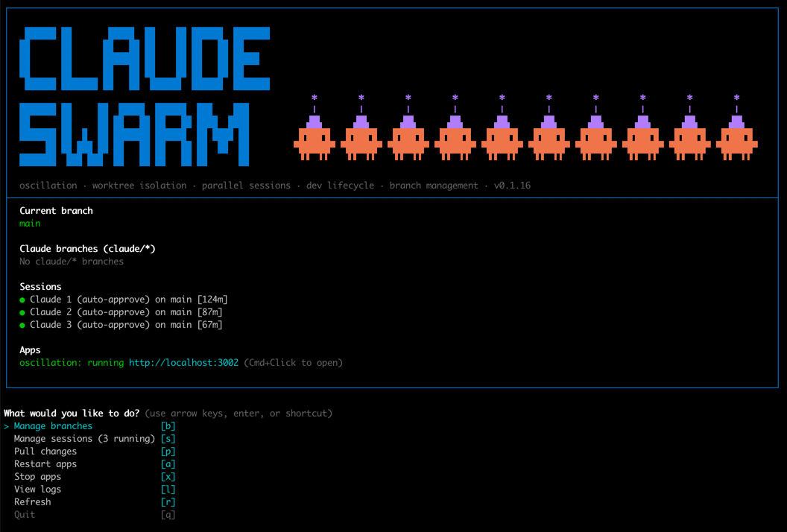

# claude-swarm

[](https://www.npmjs.com/package/@annix/claude-swarm)
[](https://www.npmjs.com/package/@annix/claude-swarm)
[](https://github.com/AnnixInvestments/claude-swarm/blob/main/LICENSE)
[](https://nodejs.org)



Manage multiple parallel Claude CLI sessions with worktree isolation and pluggable dev server lifecycle management.

## Features

- **Session Management**: Detect, spawn, and terminate Claude CLI sessions
- **Worktree Isolation**: Run parallel sessions in separate git worktrees
- **Cross-Platform**: Works on Windows, macOS, and Linux
- **GitHub Integration**: Start sessions from GitHub issues
- **Process Detection**: Distinguish between active (terminal-attached) and orphaned (detached) sessions
- **Cleanup Tools**: Kill orphaned sessions individually or in bulk
- **Pluggable App Adapters**: Manage dev servers for any project via config or built-in adapters
- **Live Log Viewing**: Tail dev server logs inside the TUI
- **Auto-Approve Mode**: Launch Claude sessions with the `--dangerously-skip-permissions` flag
- **Number Key Shortcuts**: Press 1-9 to quickly select items in all menus
- **Per-Step Timing**: Built-in timing utility for pre-push hooks
- **Responsive Banner**: Adaptive ASCII art banner that scales to terminal width

## Installation

```sh
npm install -g @annix/claude-swarm
```

Or add it as a dev dependency:

```sh
npm install -D @annix/claude-swarm
# or
pnpm add -D @annix/claude-swarm
```

The package is published on npm: [@annix/claude-swarm](https://www.npmjs.com/package/@annix/claude-swarm)

## Usage

### Interactive TUI

Run from any git repository:

```sh
claude-swarm
```

### Headless subcommands

```sh
claude-swarm start    # start all configured apps and wait for ready
claude-swarm stop     # stop all apps gracefully
claude-swarm restart  # stop then start
claude-swarm status   # print running/stopped state per app
claude-swarm logs     # print last 50 lines per app log
```

These are the same actions available in the TUI, usable from scripts and `package.json`. The conventional wiring is:

```json
"dev":  "claude-swarm start",
"stop": "claude-swarm stop"
```

The tool will detect the current project and load configuration from `.claude-swarm/config.json` in the current directory if present.

## Project configuration

### `.claude-swarm/config.json`

Create `.claude-swarm/config.json` in your project root to configure the branch prefix and dev servers. Add `logs/` and `.claude-swarm/registry.json` to `.gitignore`.

```json
{
  "branchPrefix": "claude/",
  "apps": [
    {
      "name": "backend",
      "start": "pnpm dev:backend",
      "stop": "signal:SIGTERM",
      "kill": "signal:SIGKILL",
      "port": 4001,
      "readyPattern": "Nest application successfully started"
    },
    {
      "name": "frontend",
      "start": "pnpm dev:frontend",
      "stop": "signal:SIGTERM",
      "kill": "signal:SIGKILL",
      "port": 3000,
      "health": "http://localhost:3000/api/health",
      "readyPattern": "Ready in"
    }
  ]
}
```

For platform-specific start/stop scripts, use the `{ mac, windows }` object form:

```json
{
  "start": { "mac": "./run-dev.sh", "windows": ".\\run-dev.ps1" },
  "stop":  { "mac": "./kill-dev.sh", "windows": ".\\kill-dev.ps1" },
  "kill":  { "mac": "./kill-dev.sh", "windows": ".\\kill-dev.ps1" }
}
```

### Configuration fields

| Field | Type | Default | Description |
|-------|------|---------|-------------|
| `branchPrefix` | `string` | `"claude/"` | Prefix for Claude-managed branches |
| `apps` | `AppAdapterConfig[]` | `[]` | Dev server definitions |

### App adapter config

| Field | Type | Required | Description |
|-------|------|----------|-------------|
| `name` | `string` | Yes | Display name shown in the TUI |
| `start` | `PlatformCommand` | Yes | Command to start the server |
| `stop` | `PlatformCommand` | No | Command or `signal:SIGTERM` to stop gracefully |
| `kill` | `PlatformCommand` | No | Command or `signal:SIGKILL` to force-stop |
| `port` | `number` | No | Port the app binds to — used for precise kill and status detection |
| `health` | `string` | No | HTTP URL polled by `isRunning()` — takes priority over port detection |
| `readyPattern` | `string` | No | Regex matched against log output to detect when the server is ready |
| `logDir` | `string` | No | Directory for log files (default: `logs`) |

`PlatformCommand` is `string | { mac: string; windows: string }`.

When `readyPattern` is set, `start` blocks until the pattern matches or the 120 second timeout elapses.

Dev server output is streamed to `<logDir>/<name>.log` in the project directory (default `logs/<name>.log`).

### isRunning priority

1. **Health endpoint** (`health`) — HTTP GET, 3 s timeout; most accurate
2. **Port** (`port`) — checks whether the port is bound; platform-native
3. **PID** — checks the tracked process directly

### Stop and kill

`start()` always calls `kill()` first so stale processes from previous runs are cleaned up before a new one starts.

When `port` is configured, `stop()` and `kill()` target only that port — no broad process-pattern matching that could hit unrelated processes.

Both `stop` and `kill` are optional. When omitted, the adapter falls back to sending `SIGTERM` / `SIGKILL` directly to the tracked process.

Use `signal:` when claude-swarm owns the PID directly:

```json
"stop": "signal:SIGTERM",
"kill": "signal:SIGKILL"
```

Use platform-specific scripts when the start command is a shell script that manages its own lifecycle:

```json
"stop": { "mac": "./kill-dev.sh", "windows": ".\\kill-dev.ps1" }
```

## Multi-project support

claude-swarm manages sessions across multiple projects. On first run it detects the current git repo and adds it automatically. Additional projects can be added interactively via the session menu.

Project configurations are saved to `~/.config/claude-swarm/projects.json`. This is a user-level config file shared across all invocations.

### `~/.config/claude-swarm/projects.json`

```json
{
  "projects": [
    {
      "name": "myapp",
      "path": "/Users/you/dev/myapp",
      "worktreeDir": "/Users/you/dev/myapp-worktrees"
    }
  ],
  "defaultProject": "myapp"
}
```

| Field | Type | Description |
|-------|------|-------------|
| `projects[].name` | `string` | Display name |
| `projects[].path` | `string` | Absolute path to the git repo root |
| `projects[].worktreeDir` | `string` | Where worktrees are created (default: `../name-worktrees` sibling) |
| `defaultProject` | `string` | Name of the project to select on startup |

## Timer utility

claude-swarm ships a per-step timing utility for pre-push hooks (or any multi-step shell script). It measures each step with millisecond precision, highlights the slowest step, and prints a summary table.

### Bash

```bash
source "./node_modules/@annix/claude-swarm/timer.sh"

timed_step "lint" npm run lint
timed_step "typecheck" npm run typecheck
timed_step "test" npm run test

print_timing_summary
```

### PowerShell

```powershell
. "./node_modules/@annix/claude-swarm/timer.ps1"

Invoke-TimedStep "lint" { npm run lint }
Invoke-TimedStep "typecheck" { npm run typecheck }
Invoke-TimedStep "test" { npm run test }

Write-TimingSummary
```

If any step fails, the summary prints immediately and the script exits with the failing exit code.

## Bin launcher

The `src/bin.ts` script provides hash-based auto-install/build: it only runs `npm install` or `npm run build` when source files have changed since the last run. This means subsequent invocations start instantly. When installed from npm, the build step is skipped entirely since pre-built `dist/` is included.

## Worktree workflow

All parallel work uses git worktrees for isolation — never bare branches. Each worktree gets its own directory and `claude/*` branch so multiple sessions can run without stepping on each other.

### Managing worktrees

From the main menu, press `w` to manage worktrees:

```
? What would you like to do?
> Manage worktrees            [w]
  Manage sessions (1 running) [s]
  Pull changes                [p]
  Start apps                  [a]
  Stop apps                   [x]
  View logs                   [l]
  Refresh                     [r]
  Quit                        [q]
```

Select a worktree to see available actions:

```
? Select a worktree:
  ○ claude/fix-backend-module ↑1 ↓729 (11 days ago)   [1]
> ○ claude/play-around-a-bit ↓2 behind (83 minutes ago) [2]
  Create new worktree                                   [3]
  ← Back                                               [4]
```

### Worktree actions

| Action | Description |
|--------|-------------|
| **Bring to main** | Cherry-picks all commits from the worktree onto main locally. No push, no PR. Optionally cleans up the worktree and branch afterwards. |
| **Rebase onto main** | Rebases the worktree branch onto the latest main |
| **Approve** | Rebase + fast-forward merge + delete in one step |
| **Compare with main** | Shows commits ahead and diff stats |
| **Delete** | Removes the worktree directory and deletes the branch |

### Bringing worktree work to main

1. Press `w` → select the worktree → **Bring to main**
2. If the worktree has uncommitted changes, you'll be prompted to commit them first
3. Review the commits, confirm the cherry-pick
4. Optionally clean up the worktree and branch
5. Changes are now on your local main — push when ready

## Environment profiles

Profiles let you start dev servers with different environment configurations (e.g. production database, staging secrets).

### Configuration

Add profiles to `.claude-swarm/config.json`:

```json
{
  "apps": [...],
  "envDir": "backend/configs",
  "profiles": {
    "prod": {
      "description": "Production database + S3 (CAUTION: live data!)",
      "env": {
        "provider": "flyio",
        "app": "my-fly-app",
        "secrets": ["DATABASE_HOST", "DATABASE_PASSWORD", "AWS_S3_BUCKET"]
      },
      "localOverrides": {
        "FRONTEND_URL": "http://localhost:3000"
      }
    }
  }
}
```

### Commands

```sh
claude-swarm env setup prod   # Fetch secrets from Fly.io, save to envDir
claude-swarm env list         # Show saved env configs
claude-swarm start --profile prod  # Start apps with prod env overrides
```

When starting apps from the interactive menu, you'll be prompted to choose an environment if profiles are configured. The active profile is shown as a badge in the Apps status section.

## App Adapter interface

You can use the built-in adapters programmatically:

```typescript
import {
  AppAdapter,
  NestAdapter,
  NextAdapter,
  ViteAdapter,
  NullAdapter,
  ConfigAdapter,
  DevServerAdapter,
  ProcessAdapter,
} from "@annix/claude-swarm";
```

### Built-in adapters

| Adapter | Description |
|---------|-------------|
| `NestAdapter` | NestJS backend (`nest start --watch`) |
| `NextAdapter` | Next.js frontend (`next dev`) |
| `ViteAdapter` | Vite dev server (`vite`) |
| `NullAdapter` | No-op for projects with no managed dev server |
| `ProcessAdapter` | Lightweight adapter that spawns a command and waits for a ready pattern |
| `ConfigAdapter` | Generic adapter driven by `.claude-swarm/config.json` |
| `DevServerAdapter` | Abstract base class; extend to build custom adapters |

### Custom adapters

Implement the `AppAdapter` interface:

```typescript
interface AppAdapter {
  readonly name: string;
  start(): Promise<void>;
  stop(): Promise<void>;
  kill(): Promise<void>;
  isRunning(): Promise<boolean>;
  logFile(): string | null;
}
```

`logFile()` should return the absolute path to the log file for this adapter, or `null` if no log is available. The path is used by the "View logs" TUI feature.

## Releasing

To bump the version, publish to npm, tag, and push in one step:

```sh
npm run release
```

This runs `npm version patch` (which bumps `package.json`, commits, and creates a `vX.Y.Z` git tag), then publishes to npm, and pushes the commit and tag to GitHub.

For minor or major bumps, run manually:

```sh
npm version minor -m 'feat: bump to %s' && npm publish --access public && git push && git push --tags
npm version major -m 'feat: bump to %s' && npm publish --access public && git push && git push --tags
```

## License

MIT
